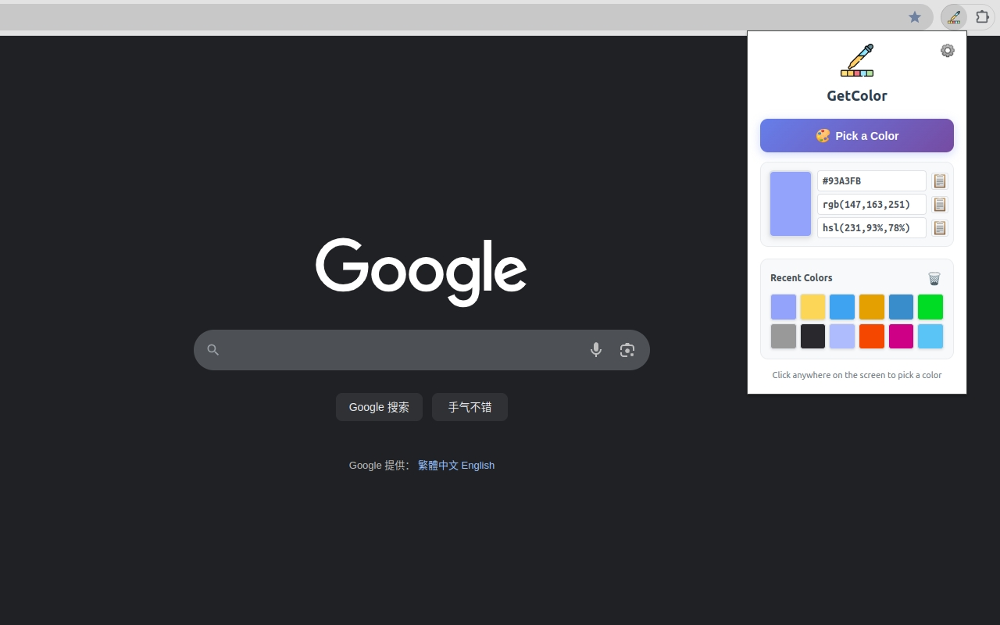

# GetColor - Browser Color Picker Extension

[中文说明](./README_zh.md) | [English](./README.md)

GetColor is a simple and useful browser extension for picking colors from anywhere on your screen.



## Project Structure

```bash
GetColor/
├── source/                 # Extension source code
│   ├── manifest.json       # Extension configuration
│   ├── popup.html          # Popup interface
│   ├── popup.css           # Styles
│   ├── popup.js            # Popup logic
│   ├── background.js       # Background script
│   ├── i18n.js             # Internationalization
│   ├── icons/              # Icon files
│   └── _locales/           # Multi-language files
├── images/                 # Store images
├── build.sh                # Build script
└── README.md               # Project description
```

## Quick Start

### Development Mode
1. Open Chrome Extensions page (`chrome://extensions/`)
2. Enable "Developer mode"
3. Click "Load unpacked extension"
4. Select the `source` directory

### Build & Release
```bash
# Using build script (recommended)
./build.sh

# Or manual build
cd source && zip -r ../GetColor-v1.0.0.zip .
```

## Features

- 🎨 **Color Picking**: Extract colors from anywhere on your screen using EyeDropper API
- 🔄 **Format Conversion**: Support HEX, RGB, HSL color formats
- 📚 **Color History**: Save recently picked colors for quick access
- 🌍 **Multi-language**: Support Chinese and English interfaces
- 💾 **Local Storage**: All data stored locally, protecting privacy

## Tech Stack

- **Manifest V3**: Latest browser extension specification
- **JavaScript ES6+**: Modern JavaScript syntax
- **Chrome Storage API**: Local data storage
- **EyeDropper API**: Color picking functionality

## Permissions

- `storage`: For saving color history and language settings

## License

MIT License - See [LICENSE](./LICENSE) file for details