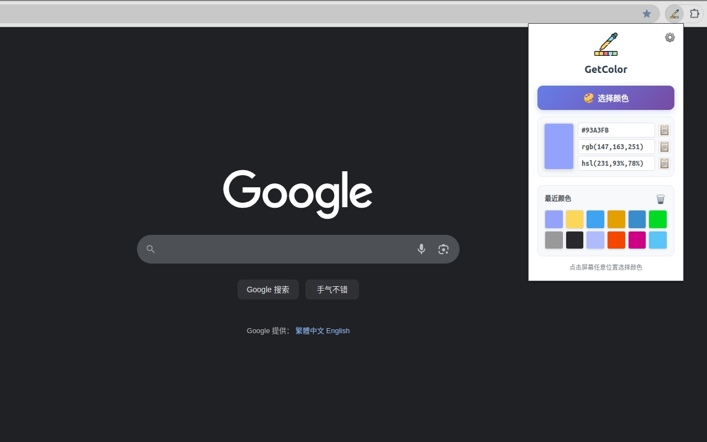

# GetColor - 浏览器颜色提取插件

[English](./README.md) | [中文说明](./README_zh.md)

GetColor 是一个简单好用的屏幕取色器/拾色器，一键提取颜色并转换为 HEX/RGB/HSL 格式。



## 项目结构

```bash
GetColor/
├── source/                 # 插件源代码目录
│   ├── manifest.json       # 插件配置文件
│   ├── popup.html          # 弹窗界面
│   ├── popup.css           # 样式文件
│   ├── popup.js            # 弹窗逻辑
│   ├── background.js       # 后台脚本
│   ├── i18n.js             # 国际化支持
│   ├── icons/              # 图标文件
│   └── _locales/           # 多语言文件
├── images/                 # 应用商店图片
├── build.sh                # 打包脚本
└── README.md               # 项目说明
```

## 快速开始

### 开发模式
1. 打开 Chrome 扩展管理页面 (`chrome://extensions/`)
2. 启用"开发者模式"
3. 点击"加载已解压的扩展程序"
4. 选择 `source` 目录

### 打包发布
```bash
# 使用打包脚本（推荐）
./build.sh

# 或手动打包
cd source && zip -r ../GetColor-v1.0.0.zip .
```

## 功能特性

- 🎨 **颜色提取**：使用 EyeDropper API 从屏幕任意位置提取颜色
- 🔄 **格式转换**：支持 HEX、RGB、HSL 三种颜色格式
- 📚 **历史记录**：保存最近选择的颜色，支持快速访问
- 🌍 **多语言**：支持中文和英文界面
- 💾 **本地存储**：所有数据保存在本地，保护隐私

## 技术栈

- **Manifest V3**：最新的浏览器插件规范
- **JavaScript ES6+**：现代 JavaScript 语法
- **Chrome Storage API**：本地数据存储
- **EyeDropper API**：颜色提取功能

## 权限说明

- `storage`：用于保存颜色历史和语言设置

## 许可证

MIT License - 详见 [LICENSE](./LICENSE) 文件
